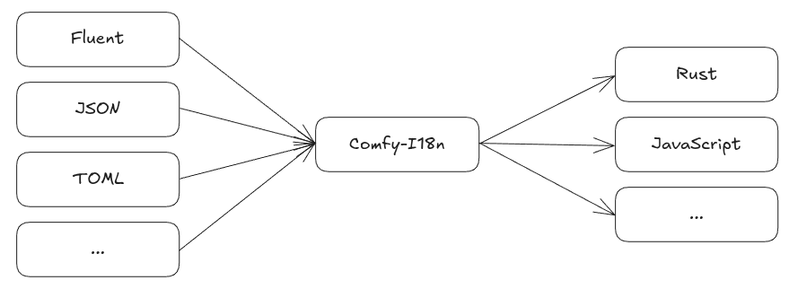

# ☕ Comfy I18n


Comfy I18n aims to be a source format and target language agnostic transpiler. Currently, only the **comfy**-format and **rust** is implemented.

It translates your i18n sources to usable structures in your source code at compile time.  
These structures are **component based** by design and are as such **nestable** and **composable**.

The API design is very opinionated and aims to use the language specific features to provide the most ergonomic API possible, while being feature rich and blazingly fast. Compared to the common dictionary based approach, it comes with an overhead in compile time and binary size.

## Core features

### ✅ Ergonomic, intuitive and extendable API
This is a small showcase of the API. Please refer to the examples in the documentation for a more detailed overview.

```rust
#[derive(ComfyI18n)]
pub enum Language {
    EN,
    #[fallback]
    DE,
    RU
}

i18n!(
    name: Animals,
    key: crate::Language,
    translations: {
        EN: {
            cat: {
                one: "Cat",
                many: "Cats"
            },
        },
        DE: {
            cat: {
                one: "Katze",
                many: "Katzen"
            },
        }
    }
)

i18n!(
    name: SomeComponent,
    key: crate::Language,
    translations: {
        EN: {
            // Fully supports core::fmt specifiers and is additionally 
            // able to interpolate constants and self references.
            fmt_like_syntax: "Hello, {self.person.name} (root.person.age)! Today is the {num_days:03}th day of the year!",
            person: {
                name: "Peter",
                age: 42,
                pronouns: ["he", "him"],
                // You can also use any constant, as long as you hint the type
                favorite_animal: Language::DE.animals().cat().one() as &'static str,
            },
            arbitary_nesting: (1, (2, [{a: 42}; 5]))
        },
        DE: {
            person: {
                name: "Anna",
                age: 21,
            }
        }
    }
)

// You can implement custom functions using the full context for more complicated cases.
// 🚧 Later, functions can be declared within the macro itself.
// 🚧 More support functions for i18n and pluralizations will be added.
impl some_component::person::Person {
    pub fn complicated_localization(&self, amount: usize) -> String {
        match self.comfy_i18n_context {
            Language::DE => match amount {
                0 => format!("Keine {}", Language::DE.animals().cat().many()),
                1 => format!("Eine {}", Language::DE.animals().cat().one()),
                num_cats => format!("{} {}", num_cats, Language::DE.animals().cat().many())
            },
            _ => match amount {
                0 => format!("No {}", Language::EN.animals().cat().many()),
                1 => format!("A {}", Language::EN.animals().cat().one()),
                num_cats => format!("{} {}", num_cats, Language::EN.animals().cat().many())
            }
        }
    }
}

fn some_component() {
    // The language enum value can easily be passed as part of the context of any framework.

    assert_eq!(
        Language::EN.some_component().fmt_like_syntax(&83)
        "Hello, Peter (42)! Today is the 083th day of the year!"
    );

    // Falls back to the english format string, using the german values for person
    assert_eq!(
        Language::DE.some_component().fmt_like_syntax(&83),
        "Hello, Anna (21)! Today is the 083th day of the year!"
    );

    // Falls back to english, as its not specified in the fallback language
    assert_eq!(
        Language::RU.some_component().person().pronouns(),
        ["he", "him"]
    );

    // Then call your custom function like this
    assert_eq!(
        Language::DE.some_component().person().complicated_localization(42),
        "42 Katzen".to_string()
    );

    // Access the localization by path or using the usual t! macro
    // Usage is strongly discouraged and only useful for migration from other libraries
    // This is also behind a feature flag
    assert_eq!(
        Language::DE::by_path<i32>("some_component.person.age"),
        t!("some_component.person.age", context = Language::DE)
    );
}
```

### ✅ Blazingly fast
Comfy I18n trades speed for binary size and compile time.  
It creates specialized structures and functions, which may or may not be optimized away by the compiler.  
Nevertheless, the binary size and compile time would be bigger compared to a dictionary based approach.

| Crate      | Literal        | Interpolation (2 args) | Interpolation (7 args) |
| ---------- | -------------- | ---------------------- | ---------------------- |
| comfy-i18n | 0.4 ns         | >53.18 ns ¹            | >136.82 ns ¹           |
| rust-i18n  | 18.96 ns       | >47.15 ns              | >84.04 ns              |

> ¹ Depending on the complexity. We use [dfmt](https://github.com/tdymel/dfmt). In the future, we will do const folding during transpilation to reduce the amount of arguments to be formatted. Also there is still some room for improvement with dfmt itself.

### 🚧 [#16](https://github.com/tdymel/comfy-i18n/issues/16): Compile time validation
Be warned if there are missing translations. Warnings during development and errors during production builds.

### 🚧 [#5](https://github.com/tdymel/comfy-i18n/issues/5): Source file support
Load localizations from different kind of source file formats, e.g. TOML, JSON, Fluent, Gettext or the custom comfy format.

### 🚧 [#18](https://github.com/tdymel/comfy-i18n/issues/18): Hot reload translations from source files
Source files are watched for changes during development and hot reloaded if changes occur.

### 🚧 [#2](https://github.com/tdymel/comfy-i18n/issues/2): Remote source files support
Load source files from a remote source on the fly. During compilation these source files are loaded to create the specification for the structure.

### 🚧 [#2](https://github.com/tdymel/comfy-i18n/issues/2): No-std support
This library already largely supports no-std environments. However, this will not be a hard requirement for the releases until all core features have been implemented.

## License
This project is licensed under either

* [Apache License, Version 2.0](https://www.apache.org/licenses/LICENSE-2.0)
  ([LICENSE-APACHE](LICENSE-APACHE))

* [MIT License](https://opensource.org/licenses/MIT)
  ([LICENSE-MIT](LICENSE-MIT))

at your option.